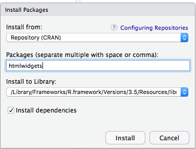
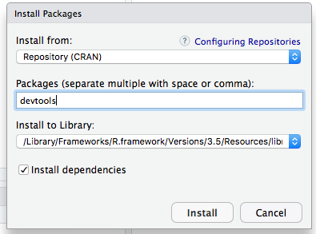
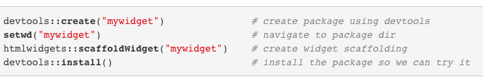

```{r setup, include=FALSE}
options(htmltools.dir.version = FALSE)
```

--
# What is a HTML Widgets Package?

```{r,echo=FALSE, fig.align='center', out.width=350, fig.height= 350}
knitr::include_graphics("images/G.jpg")
```
--
The htmlwidgets bundle that gives a structure to effectively making R ties to the libraries. These gadgets made utilizing the structure can be: 

--


- Utilized at the R comfort for information examination simply like customary R plots (by means of RStudio Viewer) 

- Flawlessly inserted inside R Markdown records and Shiny web applications. 

- Spared as independent site pages for impromptu sharing through email, Dropbox
---
# Getting Started. 
--


**First**. 


--
* INSTALL THE HTMLWIDGETS PACKAGE. 
```{r,echo=FALSE, fig.align='center', out.width=300, fig.height= 300}

```
--
* INSTALL THE DEVTOOLS PACKAGE. 

```{r,echo=FALSE, fig.align='center', out.width=300, fig.height= 300}

```
---
class: middle
##Creating htmlWidget. 


```{r,echo=FALSE, fig.align='center', out.width=350, fig.height= 350}

```

--
To create a new widget you can call the scaffoldWidget function to generate the basic structure for your widget. This function will:

```{r,echo=FALSE, fig.align='center', out.width=1000, fig.height= 1000}

```

---
##Widget Sizing 

--


**WHY DO YOU NEED TO SIZE THE WIDGET?**


--


This is handled in two step: 


--

-  First, a sizing policy is specified for the widget. This is done via the  sizingPolicy argument to the createWidget function. 


--

-  The sizing policy is used by the framework to compute the correct width and height for a widget given where it is being rendered. 

--
```{r,echo=FALSE, fig.align='center', out.width=750, fig.height= 750}
knitr::include_graphics("images/LR.png")
```
---
##EXAMPLE CODE OF HOW TO UTILIZE HTML WIDGETS. 
- CREATE AN RMD FILE

```{r}
#' @export
sigmaOutput <- function(outputId, width = "100%", height = "400px") {
  htmlwidgets::shinyWidgetOutput(outputId, "sigma", width, height, package = "sigma")
}
#' @export
renderSigma <- function(expr, env = parent.frame(), quoted = FALSE) {
  if (!quoted) { expr <- substitute(expr) } # force quoted
  htmlwidgets::shinyRenderWidget(expr, sigmaOutput, env, quoted = TRUE)
}
library(shiny)

gexf <- system.file("examples/ediaspora.gexf.xml", package = "sigma")
ui = shinyUI(fluidPage(
  checkboxInput("drawEdges", "Draw Edges", value = TRUE),
  checkboxInput("drawNodes", "Draw Nodes", value = TRUE),
  sigmaOutput('sigma')
))
server = function(input, output) {
  output$sigma <- renderSigma(
    sigma(gexf, 
          drawEdges = input$drawEdges, 
          drawNodes = input$drawNodes)
  )
}
shinyApp(ui = ui, server = server)
```


